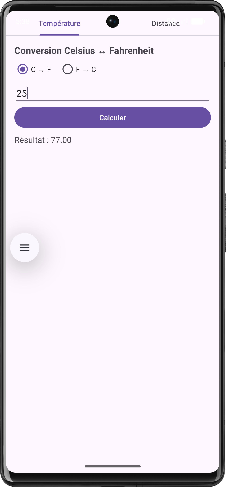
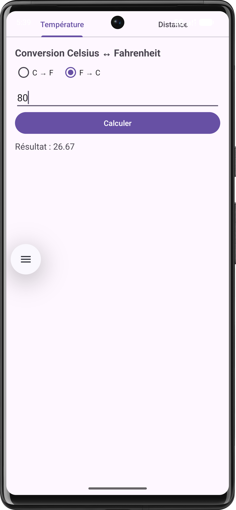
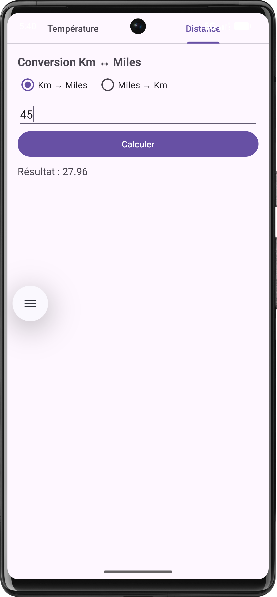
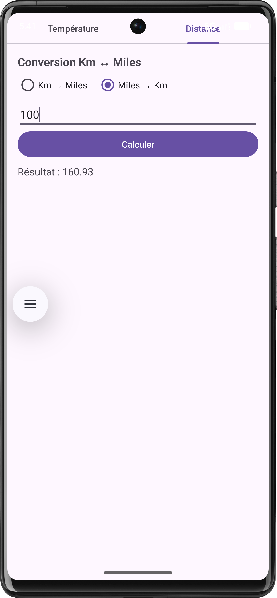

# LAB 5 – Convertisseur Température & Distance

> Application Android avec Fragments et Onglets (TabLayout + ViewPager2)

## 📋 Description

Application Android composée de deux onglets :
- **C ↔ F** : Convertir les températures (Celsius ↔ Fahrenheit)
- **KM ↔ Miles** : Convertir les distances (Kilomètres ↔ Miles)

L'application inclut un menu **"Quitter"** et intercepte la touche **Retour** pour demander une confirmation avant de fermer.

## 📸 Démonstration

| C → F | F→  C |
|-------|-------|
|  |  |

| KM → Miles | Miles → KM |
|-----------|-----------|
|  |  |

## 🛠️ Technologies utilisées

- Java (Android)
- Fragments
- TabLayout + ViewPager2
- Menu Options
- AlertDialog (confirmation quitter)

## 🚀 Lancer le projet

1. Cloner le dépôt : `git clone https://github.com/USERNAME/REPO.git`
2. Ouvrir dans **Android Studio**
3. Lancer sur un émulateur ou appareil physique

## 👤 Auteur

**Zakaria Aouinati** – Cours : Programmation Mobile Android avec Java